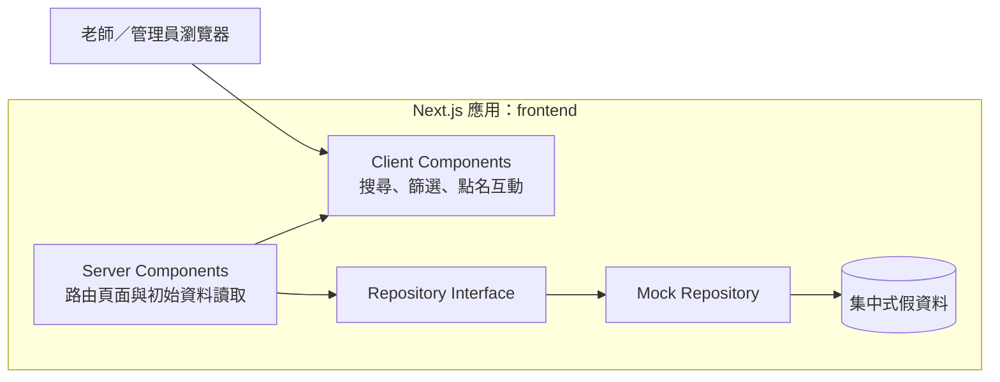
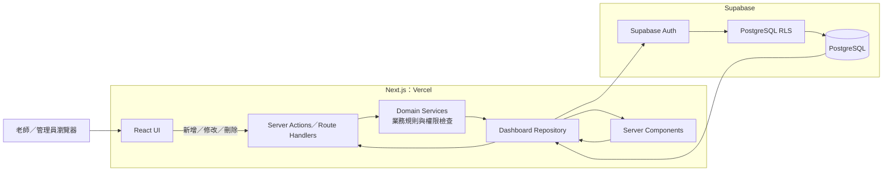
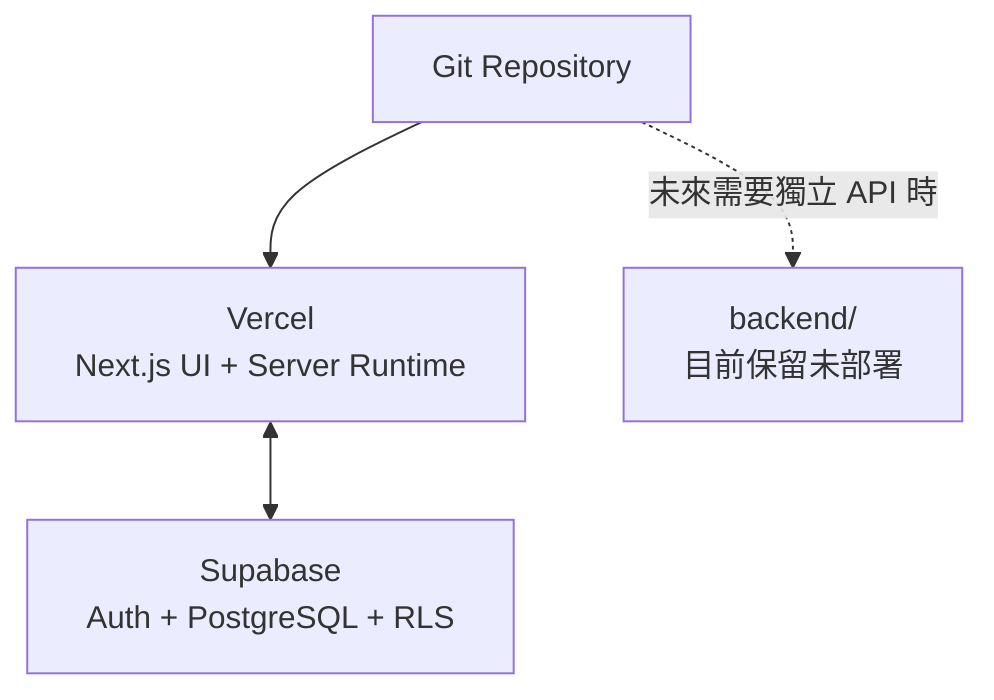
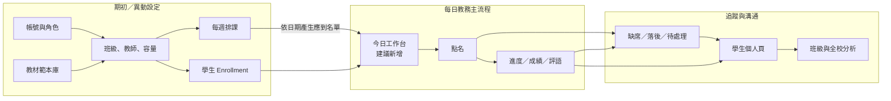

# 系統架構

## 1. 現行第一版架構

目前是「單一 Next.js 專案、前後端邏輯分層」：畫面與伺服器程式碼一起部署，但瀏覽器端不能直接引用 `src/server/`。



### 現行責任邊界

| 區域 | 執行位置 | 責任 |
|---|---|---|
| `src/app/` | Next.js Server | 路由、頁面組合、初始資料取得 |
| `src/components/` | Server／Browser | UI 呈現與使用者互動 |
| `src/server/domain/` | Server | Domain 型別與 View Model |
| `src/server/repositories/` | Server | 統一資料存取合約與 Mock 實作 |
| `src/server/data/mock/` | Server | 集中式假資料與關聯資料 |

出缺席頁面亦遵循相同邊界：`attendance/page.tsx` 僅呼叫 Attendance Repository，Repository 再整合指定日期的應到名單與現有點名紀錄；頁面不直接讀取 Mock fixture。

## 2. 未來 Supabase 架構

串接資料庫後，UI 元件輸入型別保持不變，主要替換 Repository 實作，並增加 Action、Service、Auth 與 RLS。



## 3. 後端分層定義

```text
UI / Page
   ↓
Action（HTTP 或 Server Action 入口）
   ↓
Service（業務流程與應用權限）
   ↓
Repository（SQL、JOIN、資料轉換）
   ↓
Supabase PostgreSQL + RLS（最終資料隔離）
```

- Action：驗證輸入格式、取得登入身分、呼叫 Service、回傳結果。
- Service：處理例如重複入班、班級狀態、可否點名等業務規則。
- Repository：集中處理 Supabase 查詢、JOIN、分頁和 View Model mapping。
- RLS：即使應用程式權限判斷失誤，資料庫仍限制跨組織或跨角色存取。

## 4. 部署關係



第一階段不需要獨立部署 `backend/`。未來如果有手機 App、多個前端、長時間背景工作或複雜整合，才評估將 Service 與 Repository 搬到獨立後端。

## 5. 現行 Mock RBAC

```text
Persona Cookie → IdentityProvider → AuthorizationContext
                              ├→ Permission Policy → Route／Action
                              └→ Data Scope → Repository 班級篩選
```

角色決定可使用的功能，`organization-wide`／`assigned-classes` 決定可讀取的資料範圍。Client 只接收能力結果；Cookie 只保存 persona key，角色、organization 與班級皆由 Server 假資料重新解析。這是開發驗證機制，不可視為正式登入。

## 6. 前端互動套件目錄

| 套件 | 版本 | 用途 | 擁有邊界 | 不採用套件時的替代方案 |
|---|---:|---|---|---|
| `@dnd-kit/core` | `6.3.1` | 拖曳生命週期、碰撞偵測及滑鼠／觸控／鍵盤感測器 | 僅 `curriculum-sortable-list.tsx` Client Component | 原生 Pointer Events + 自行實作鍵盤與可及性狀態 |
| `@dnd-kit/sortable` | `10.0.0` | 垂直清單排序、鍵盤座標與陣列換位 | 教材範本內容清單 | 自訂排序演算法及 DOM 位移管理 |
| `@dnd-kit/utilities` | `3.2.2` | 將拖曳 transform 轉成安全 CSS | 教材範本排序列 | 手動產生 CSS transform |

dnd-kit 不進入 Server、Service 或 Repository；資料庫仍只接受完整 stable item ID 順序，並由 Service 驗證權限、草稿狀態與 revision。教材清單以支援滑鼠、觸控及鍵盤的拖曳把手作為唯一排序入口。
# Student detail boundary

The student detail route composes client-safe profile, guardian, multi-class, assessment, and study-plan view models. Writes enter Server Actions, then services enforce permission, organization/class scope, validation, duplicate rules, and optimistic revision. Student roster mutations cross the `StudentRosterMutationRepository` contract before reaching the current Mock adapter; Supabase PostgreSQL with RLS can replace that adapter without changing the service or browser components. Other normalized Mock stores are migrated to the same boundary incrementally.

## 7. 班級管理與每日點名邊界

```mermaid
flowchart LR
    UI[/classes/new 與 /classes/classId/edit] --> A[Class Server Actions]
    A --> S[Class Management Service]
    S -->|權限、組織、容量、時段、revision| M[(Normalized Class Mock Store)]
    P[/classes、/students] --> R[Class / Student Roster Repositories]
    T[/attendance?date=] --> E[Expected Attendance Query]
    M --> R
    M --> E
    E -->|active class + weekday slot + active enrollment| T
    M -.正式環境替換.-> DB[(Supabase PostgreSQL transaction + RLS)]
```

班級純量、科目、年級範圍、教師指派、每週時段與 enrollment 分開正規化。建立／編輯送出完整 aggregate，Service 在單次 store mutation 前完成驗證；失敗不留下部分關聯。學生名單仍共用 `/students?classId=<id>`，點名應到名單則由日期對應的有效班級時段與 active enrollment JOIN 產生。結業與封存保留 stable class ID 及歷史資料，但不再產生未來應到名單。

## 8. 使用者操作架構

系統應區分「低頻設定」與「每日教務」。帳號、教材、班級與排課不是老師每天反覆操作的入口；日常使用應從今日工作開始，完成點名後接續登錄進度、成績與評語，最後才進入學生或班級分析。



### 導覽層級建議

```text
首頁／今日工作
├─ 今日點名
├─ 今日進度與成績
└─ 待處理學生

教務管理
├─ 學生名單
├─ 課程班級
└─ 教材範本庫

追蹤分析
├─ 學生進度
└─ 學習指標

系統設定
├─ 帳號管理
└─ 角色權限
```

目前側邊欄將所有頁面放在同一層，功能雖可到達，但使用者需要自行判斷「今天先做哪一件事」。建議下一版加入今日工作入口並將選單分組；完整操作方式與調整優先序見 [`docs/user-operation-manual.md`](./user-operation-manual.md)。
## 認證、授權與操作紀錄（2026-09）

```text
Login／Password UI
  → Server Action（不接受公開註冊）
  → Auth Provider ──→ Session Provider
  → Membership Repository
  → AuthorizationContext（organization／role／permissions／scope）
  → Protected Page／Service／Repository

Material mutation
  → 重新解析 Session
  → Permission + scope 驗證
  → Audit writable check
  → Domain mutation
  → Append-only Audit event
```

目前 adapter 為開發用 Mock；Production 必須使用 Supabase Auth、SMTP 與 PostgreSQL Audit。Provider 設定不完整時登入會 fail closed，且不會回退成 Mock Owner。正式綁定資料與切換順序見 [Supabase Auth、Email 與 Audit 正式串接交接](supabase-auth-audit-handoff.md)。
