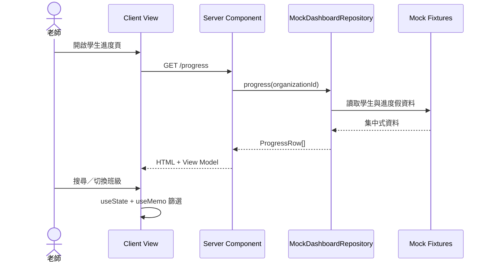
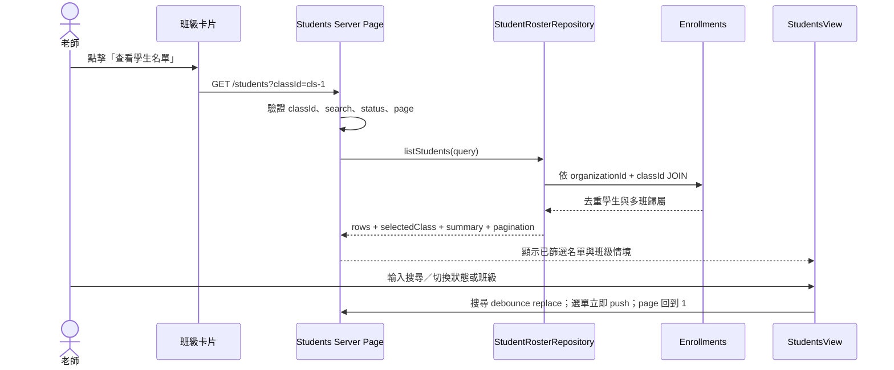
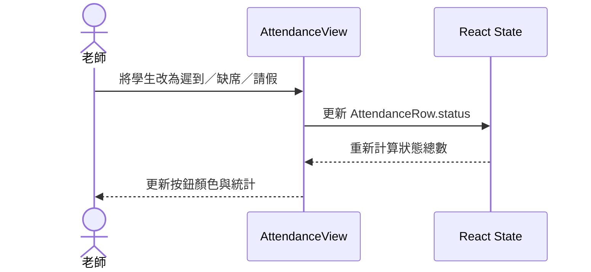
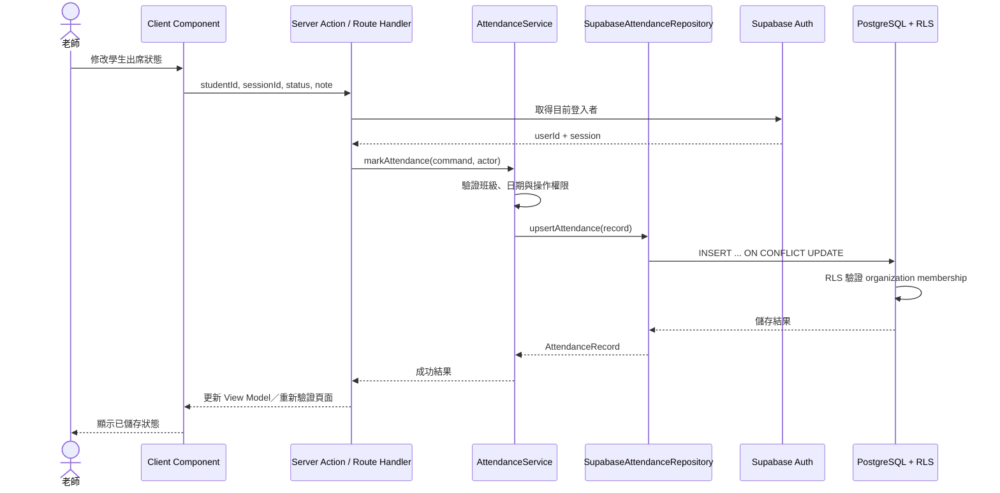
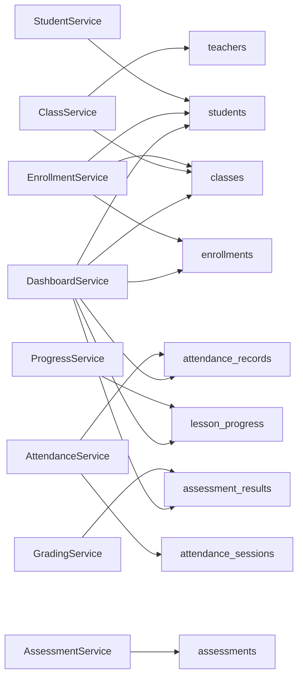
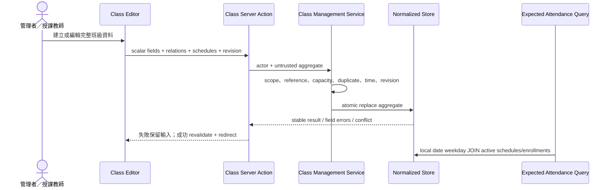
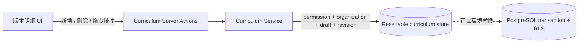
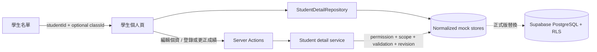

# UI 與後端操作流程

## 1. 操作狀態總覽

| 畫面 | UI 操作 | 現行行為 | 未來後端 Action |
|---|---|---|---|
| 學生進度 | 搜尋、班級篩選 | Client 記憶體篩選 | 大資料量時改成帶查詢參數的分頁查詢 |
| 學生名單 | 班級、搜尋、狀態、分頁 | URL query 驅動 Server Repository；由 enrollment JOIN | 換 Supabase Repository 後沿用 `listStudents(query)` 合約 |
| 課程班級 | 搜尋、年級篩選、查看學生名單 | Client 篩選；班級卡片連到 `/students?classId=<id>` | `listClasses`；建立班級使用 `createClass` |
| 出缺席 | 日期、班級、切換狀態 | 狀態只保存在目前瀏覽器 session | `upsertAttendanceRecord` |
| 學習指標 | 查看趨勢與分布 | Server 取得 Mock 統計 | `getAnalytics`，由 SQL aggregate/view 計算 |
| 帳號管理 | 篩選、角色／狀態調整 | Server Action → AccessService → Mock Store | 未來替換為 Supabase membership tables |
| 角色權限 | 檢視與儲存權限 | Server Action → 權限相依／版本檢查 → Mock Store | 未來加入 audit log 與 RLS |

所有管理寫入都由 Server 重新解析 Actor；UI 隱藏按鈕不是安全邊界。最後一位 Owner 不可停用或降級，主任不能異動 Owner 或系統角色，無權或跨組織目標採 fail-closed。學生使用 `self-student` scope，家長使用 server-owned `linked-students` scope；老師使用 `assigned-classes`。

Mock 身分切換流程為 `Shell selector → selectPersona Server Action → HttpOnly persona cookie → identity-core → recommended route redirect`。正式版會把 Cookie persona 替換成 Supabase Session，但保留 client-safe persona 說明、權限碼與 Repository／Service 驗證邊界。

## 班級今日課堂進度

```text
/classes/[classId]?date=YYYY-MM-DD
  → ClassSessionRepository 建立或讀取 ClassSession 與成員快照
  → 依每位 studentId JOIN active Study Plan 與 StudentLearningItem
  → 老師選擇學習項目、pending / in_progress / completed、選填 note
  → saveDailyProgressAction
  → ClassSessionService 驗證 organization、assigned class、member、plan、item、revision
  → 全部通過後 append StudentSessionProgress 並更新 StudentLearningItem
```

- 班級只決定當次成員，不決定教材版本。
- 一位學生一堂課可有多筆不同教材進度。
- 請假／缺席預設 `本次不更新`；沒有 entry 就不改目前進度。
- 更正會新增帶有 `supersedesId` 與原因的後續紀錄，不覆蓋原歷史。
- 草稿課堂可先新增／調整多筆進度，最後按「統一更新課堂進度」一次送出。
- 已完成課堂不開放一般覆寫，但可批次補登缺少的進度；老師需填一次補登原因，系統 append 新歷史並同步目前狀態。

## 2. 現行讀取流程



學生進度頁的搜尋仍是 Client 記憶體篩選；學生名單已改成 URL 驅動的 Server 查詢。

## 2.1 班級卡片到學生名單



學生名單不提供獨立搜尋或清除按鈕。班級與狀態選單的空值「全部」會移除該 URL 條件；搜尋輸入完成後自動更新。篩選切換只局部重繪資料，不顯示 Toast、Modal 或浮動提示。

`classId` 不存在或不屬於目前 organization 時採 fail-closed：不顯示該班資料，
也不退回總名單。合法但沒有符合學生時，則顯示可清除條件的空結果。

## 3. 現行出缺席操作



注意：重新整理頁面後會恢復假資料，目前沒有永久保存。

## 4. 未來資料寫入標準流程



## 5. 建議 Action 清單

### Students

```text
listStudents(filters, pagination)
getStudentDetail(studentId)
createStudent(input)
updateStudent(studentId, input)
archiveStudent(studentId)
```

### Classes / Enrollments

```text
listClasses(filters)
createClass(input)
assignTeacher(classId, teacherId)
enrollStudent(classId, studentId)
transferStudent(studentId, fromClassId, toClassId)
withdrawStudent(classId, studentId)
```

### Attendance

```text
getAttendanceSheet(classId, date)
upsertAttendanceRecord(sessionId, studentId, status, note)
submitAttendanceSession(sessionId)
```

### Assessments / Progress

```text
listAssessments(classId)
recordAssessmentResult(assessmentId, studentId, score)
updateLessonProgress(studentId, classId, completedLessonId)
getStudentProgress(filters)
getAnalytics(filters)
```

## 6. Service 與資料表影響圖



一個 Service 可以操作多張表；切分依據是業務流程，不是「一張 Table 建一個 Service」。

## 7. 錯誤與 UI 回饋標準

| 後端結果 | UI 行為 |
|---|---|
| 驗證失敗 | 在欄位旁顯示可理解的錯誤訊息 |
| 沒有權限 | 顯示無權操作，不洩漏資料是否存在 |
| 儲存成功 | 更新畫面並顯示成功提示 |
| 網路錯誤 | 保留使用者輸入，提供重試 |
| 資料衝突 | 重新取得最新資料並提示使用者確認 |

## 8. 班級管理與排課操作



| UI 操作 | Action／Service | 主要防護 |
|---|---|---|
| 新增班級 | `saveClassStateAction` → `createClass` | owner/admin、組織來源、唯一名稱／代碼、容量與 references |
| 編輯班級／排課／名單 | `saveClassStateAction` → `updateClass` | assigned teacher scope、protected fields、完整 replacement、revision |
| 結業／封存 | `changeClassLifecycleAction` → `changeClassLifecycle` | 明確確認、owner/admin、revision、保留歷史、無 hard delete |
| 查看班級學生 | `/students?classId=<id>` → `studentRosterRepository` | 共用 active enrollment、組織與 accessible class scope |
| 產生應到名單 | `/attendance?date=<local-date>` → `expectedAttendance` | active lifecycle、weekday schedule、active enrollment、同班去重 |
# 教材與修課計畫操作

`教材範本頁 → Server Action → curriculum-service → curriculumStore（未來 Supabase）`

`學生個人頁 → 建立修課計畫 → 複製已發布版本項目快照 → 個人進度更新`

發布版本後不可直接修改；既有學生計畫保留自己的學習項目快照，不受後續範本改版影響。

## 教材項目新增、刪除與排序



| 操作 | Action | Service 防護 |
|---|---|---|
| 新增項目 | `addTemplateItemStateAction` | 類型、名稱、組織、草稿狀態、revision |
| 刪除項目 | `deleteTemplateItemAction` | stable item id、子項目、草稿狀態、revision |
| 拖曳／鍵盤排序 | `reorderTemplateItemsAction` | 完整且不重複的 stable item IDs、組織、草稿狀態、revision |

拖曳時 UI 先樂觀更新，且同一時間只送出一個完整排序命令；若 revision 衝突或儲存失敗，立即回復操作前順序。刪除章節時會一併刪除直接子項目並重新壓縮 position。UI 隱藏／停用不是安全邊界；直接提交已發布版本或無權操作仍由 Service 拒絕。

# 學生個人頁與考試紀錄



| UI 操作 | 權限 | Action | 防護 |
|---|---|---|---|
| 查看個資／家長 | `student_profiles.read` | repository query | 組織與授課班級 |
| 編輯個資／家長 | `student_profiles.manage` | `updateStudentProfileAction` | 必填、stable id、revision |
| 查看考試紀錄 | `assessment_history.read` | repository query | scope、filter、pagination |
| 登錄／更正 | `assessment_history.manage` | result actions | 所有權、分數、duplicate、revision、actor |
# 學生名單管理

```text
/students 新增學生／單筆設定
  → saveStudentRosterStateAction
  → saveStudentRoster
  → 驗證組織、students.manage 與輸入資料
  → 若修改班級，再驗證 classes.manage、班級容量與 Enrollment
  → 更新 Mock student／Enrollment
  → revalidate /students、/classes、/attendance
```

- `students.manage`：新增學生、修改學生主檔與在籍狀態。
- `classes.manage`：搭配 `students.manage` 修改班級歸屬；取消班級只結束 Enrollment，不刪除歷史紀錄。
- 學生名單不提供批次刪除。老師的 `student_profiles.manage` 只處理授權學生的個資與學習紀錄，不等於名單治理權限。
- 封存流程：`changeStudentLifecycleStateAction → changeStudentLifecycle`，必填原因並寫入 `archivedAt`、`archivedBy`、`archiveReason`，同時結束 active Enrollment；歷史成績、出勤、課堂與個人資料不刪除。
- 恢復流程不重建 Enrollment，先回到 `leave`，由管理者確認班級後再恢復在籍。班級結業不會自動封存學生。
## 登入、Owner 帳號與 Audit

| UI 操作 | Route／Component | Server Action | Service／Provider | Audit |
|---|---|---|---|---|
| 帳密登入 | `/login`／`LoginForm` | `loginAction` | `authenticateAccount` → Auth／Session／Membership | `auth.login` success／denied |
| 登出 | Shell | `logoutAction` | Session revoke | `auth.logout` |
| 忘記密碼 | `/password/forgot` | `forgotPasswordAction` | Password link + Email | `password.reset_requested` |
| Email 連結更新密碼 | `/password/reset` | `resetPasswordAction` | replace credential + consume link + revoke sessions | `password.changed` |
| 個人申請修改密碼 | `/settings/profile` | `requestSelfPasswordChangeAction` | account-bound link + Email | `password.reset_requested` |
| Owner 建立帳號 | `/settings/accounts` | `createAccountAction` | `createOwnerManagedAccount` | `account.created` |
| 停用／恢復／角色 | `/settings/accounts` | `updateAccountAction` | provider status + membership + session revoke | account／role event |
| 更新信箱／重寄／強制重設／撤銷登入 | `/settings/accounts` | `manageAccountCredentialAction` | Account administration service | credential／session event |
| 查閱操作紀錄 | `/settings/audit` | Server page query | organization-scoped Audit repository | read only |

重要異動一律先確認 Audit 可寫；如果 Audit persistence 不可用，Action 不執行 mutation 或回報成功。Audit metadata 僅允許最小欄位，禁止 password、hash、token、完整 reset link、Email／電話／姓名等不必要個資。
